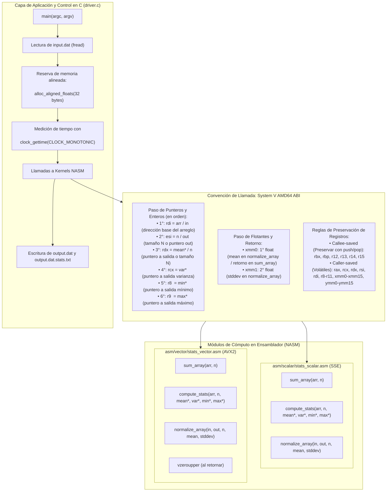
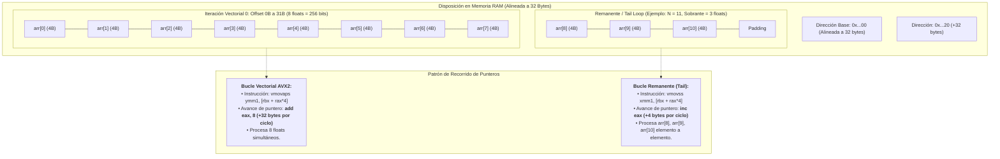

# Especificación de Diagramas de Arquitectura (Rúbrica 3.a)

Este documento contiene los cuatro diagramas y tablas técnicas exigidas por la rúbrica del proyecto (15 puntos).

---

## 1. Diagrama de Bloques de la Arquitectura de Software y ABI (Rúbrica 3.a.1 - OA1/OA3)

Este diagrama modela la comunicación entre el programa principal en C (`driver.c`) y las librerías en ensamblador x86-64 (`stats_scalar.asm` y `stats_vector.asm`) bajo el estándar **System V AMD64 ABI**.

---

## 2. Diagrama de Flujo de Control del Bucle Principal y Remanente (Rúbrica 3.a.2 - OA4)

Muestra la diferencia estructural entre el bucle escalar (1 float por ciclo) y el bucle vectorial AVX2 (8 floats por ciclo) con su transición al bucle remanente (*tail loop*).

```mermaid
flowchart TD
    subgraph VEC_FLOW ["Flujo del Kernel Vectorial (AVX2 + Tail)"]
        V_START["Inicio: compute_stats / normalize_array"] --> V_EDGE{"¿N <= 0?"}
        V_EDGE -- Sí --> V_ZERO["Escribir 0.0 y Retornar"]
        V_EDGE -- No --> V_CALC["Calcular límite vectorial:
        ecx = N & ~7 (múltiplo de 8)
        eax = i = 0"]

        V_CALC --> V_LOOP{"¿i < ecx?"}
        V_LOOP -- Sí (Bucle AVX2) --> V_BODY["• vmovaps ymm1, [rbx + rax*4] (8 floats)
        • vaddps / vminps / vmaxps / vsubps
        • add eax, 8 (+32 bytes)"]
        V_BODY --> V_LOOP

        V_LOOP -- No --> V_RED["Reducción Horizontal:
        vextractf128 + vaddps + vhaddps
        (Colapsa 8 carriles a 1 escalar)"]

        V_RED --> V_TAIL{"¿i < N?
        (Remanente)"}
        V_TAIL -- Sí (Bucle Tail) --> V_TBODY["• vmovss xmm1, [rbx + rax*4] (1 float)
        • vaddss / vminss / vmaxss
        • inc eax (+4 bytes)"]
        V_TBODY --> V_TAIL

        V_TAIL -- No --> V_CLEAN["vzeroupper"] --> V_RET["Retorno (ret)"]
    end

    subgraph SCA_FLOW ["Flujo del Kernel Escalar (SSE Puro)"]
        S_START["Inicio"] --> S_EDGE{"¿N <= 0?"}
        S_EDGE -- Sí --> S_ZERO["Escribir 0.0 y Retornar"]
        S_EDGE -- No --> S_INIT["eax = i = 0"]
        S_INIT --> S_LOOP{"¿i < N?"}
        S_LOOP -- Sí --> S_BODY["• movss xmm1, [rbx + rax*4] (1 float)
        • addss / minss / maxss
        • inc eax (+4 bytes)"]
        S_BODY --> S_LOOP
        S_LOOP -- No --> S_RET["Retorno (ret)"]
    end
```

---

## 3. Tabla de Asignación de Registros (Rúbrica 3.a.3 - OA3)

### 3.1 Kernel `compute_stats`

| Registro | Tipo / Tamaño | Versión Escalar (`stats_scalar.asm`) | Versión Vectorial (`stats_vector.asm`) |
| :--- | :--- | :--- | :--- |
| `rdi` | Puntero 64b | Puntero de entrada `arr` | Puntero de entrada `arr` (alineado a 32B) |
| `esi` / `r12d` | Entero 32b | Tamaño $N$ del arreglo | Tamaño $N$ del arreglo |
| `rdx` / `r13` | Puntero 64b | Puntero de salida `mean*` | Puntero de salida `mean*` |
| `rcx` / `r14` | Puntero 64b | Puntero de salida `var*` | Puntero de salida `var*` |
| `r8` / `r15` | Puntero 64b | Puntero de salida `min*` | Puntero de salida `min*` |
| `r9` / `[rsp]` | Puntero 64b | Puntero de salida `max*` (en pila) | Puntero de salida `max*` (en pila) |
| `rbx` | Puntero 64b | Preserva puntero base `arr` | Preserva puntero base `arr` |
| `rax` | Entero 64b | Contador de índice $i$ ($+1$) | Contador de índice $i$ ($+8$ en vector, $+1$ en tail) |
| `ecx` | Entero 32b | No requerido | Límite del bucle vectorial: $N_{\text{vec}} = N \ \& \ (\sim 7)$ |
| `ymm0` / `xmm0` | Floats | Acumulador suma $\sum x_i$ / media $\mu$ | 8 sumas parciales $\to$ reducida a media $\mu$ |
| `ymm1` / `xmm1` | Floats | Float actual $x_i$ / temporal | Buffer de 8 floats leídos con `vmovaps` |
| `ymm2` / `xmm2` | Floats | Mínimo acumulado escalar | 8 mínimos parciales con `vminps` $\to$ reducido |
| `ymm3` / `xmm3` | Floats | Máximo acumulado escalar | 8 máximos parciales con `vmaxps` $\to$ reducido |
| `ymm4` / `xmm4` | Floats | Acumulador de varianza $\sum(x_i - \mu)^2$ | Acumulador vectorial de varianza $\to$ reducido |
| `ymm5` | Vector 256b | No utilizado | Broadcast de la media: $[\mu, \mu, \mu, \mu, \mu, \mu, \mu, \mu]$ |
| `xmm6` / `xmm7` | Floats | $N$ convertido a float (`cvtsi2ss`) | Registros temporales para reducción horizontal |

---

## 4. Diagrama de Memoria y Alineación a 32 Bytes (Rúbrica 3.a.4 - OA4)

Representación de la disposición en memoria RAM con `alloc_aligned_floats(32, ...)` y el avance de punteros (+32 bytes en AVX2 vs +4 bytes en escalar y remanente):

